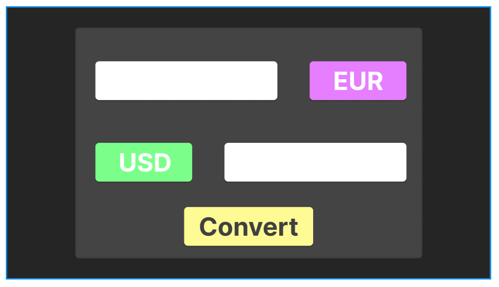
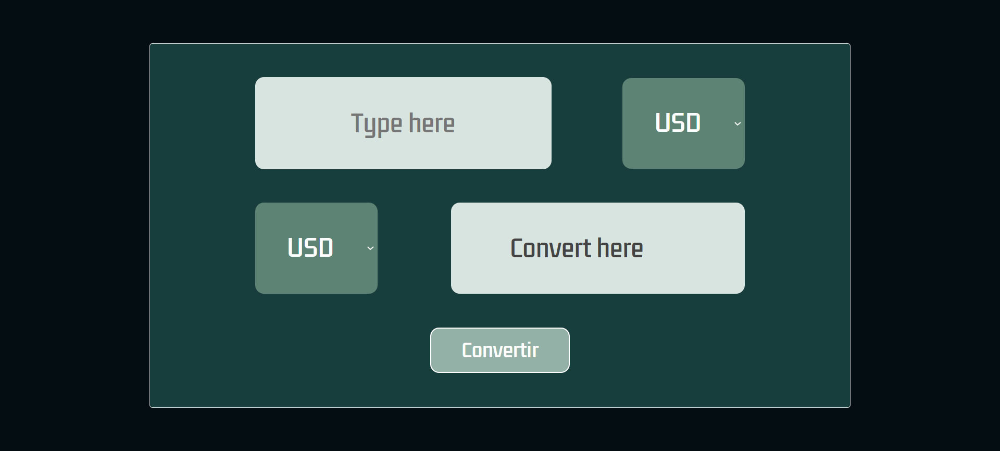
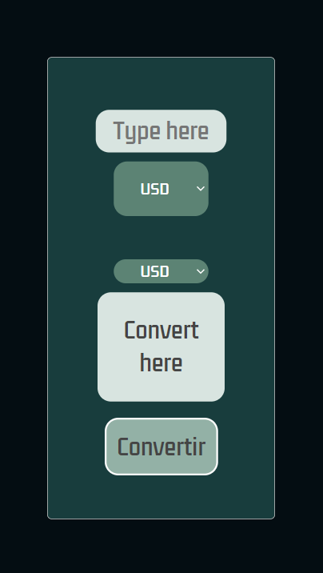

# the-dream
-----------------------------------------------
## Description courte de projet:

Voici un convertiseur de devises utilisant une API avec un style simple et minimaliste. Vous avez un choix entre 3 différentes devises. Le Livre, l'Euro ou le Dollars. 
-----------------------------------------------
Photo de la maquette du projet

VERSION WEB :

VERSION MOBILE :

-----------------------------------------------
Lien pour voir la site
[the-dream](the-dream-ts.great-site.net)
-----------------------------------------------
## Techs utilisés
- PHP
- API
-----------------------------------------------
## Development (How to run)
1. Extract the folder from Github
2. Export them to your local server (exemple: Laragon)
3. Start it and select the good folder if you have multiple project
------------------------------------------------
Copyright - 15/11/23